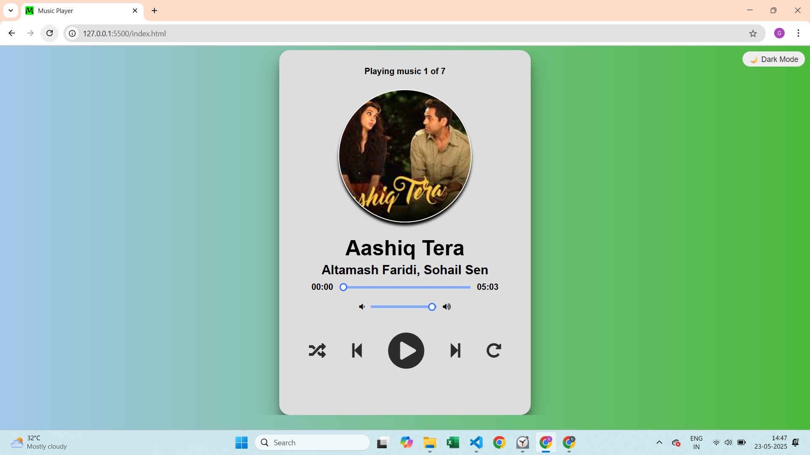
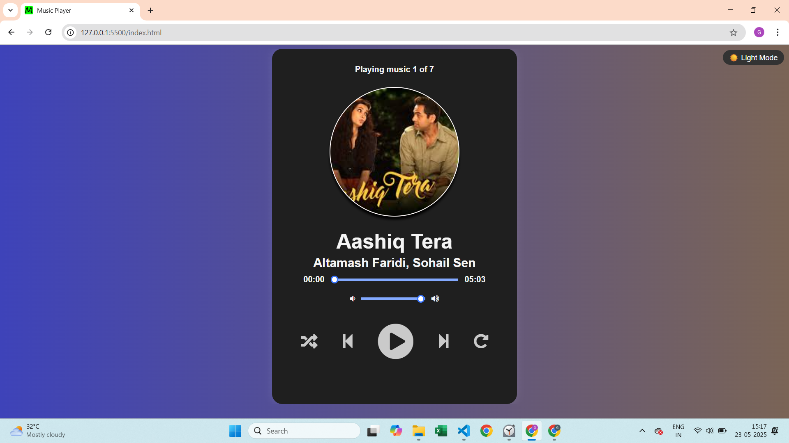

# 🎵 Music Player

A clean and modern Music Player web app built with **HTML**, **CSS**, and **Vanilla JavaScript**. Designed to offer a smooth and responsive user experience with essential music playback features.

## 🚀 Features

- 🔁 Play, Pause, Next, Previous controls
- 🎚 Volume and progress slider
- ⏱ Current time and total duration display
- 🌙 Dark/Light theme toggle
- ⌨️ Keyboard shortcuts (Space: Play/Pause, Arrow keys: Next/Previous)
- 📱 Fully mobile responsive design
- 🎶 Live animated wave effect during playback
- 🎵 Custom favicon for branding

## 🛠 Built With

- HTML5
- CSS3
- JavaScript (Vanilla)
- Font Awesome

## 📁 Project Structure

Music-Player/
│
├── images/ # Icons,Album photos, favicon
├── music/ songs
├── index.html # Main HTML file
├── style.css # All CSS styles
├── script.js # Main JavaScript file
└── README.md # Project description

## 📌 Screenshot
## Light Theme

## Dark Theme

## 📌 How to Use

1. Clone the repo:

2. Open the `index.html` file in your browser.

## 📄 License

This project is licensed under the MIT License.

---

